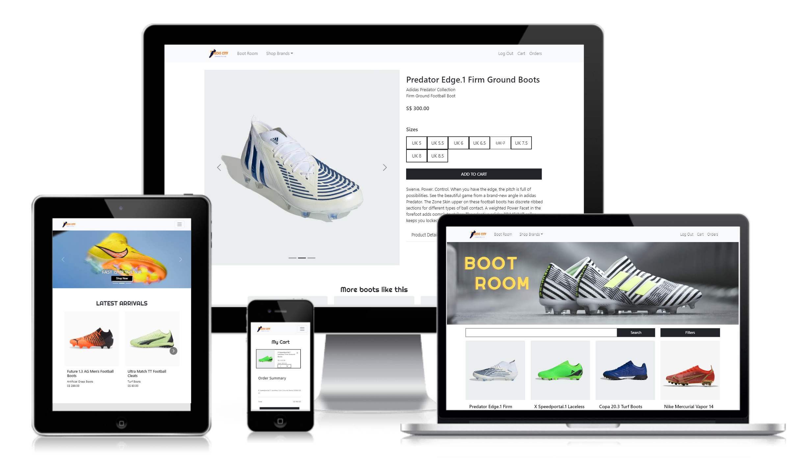
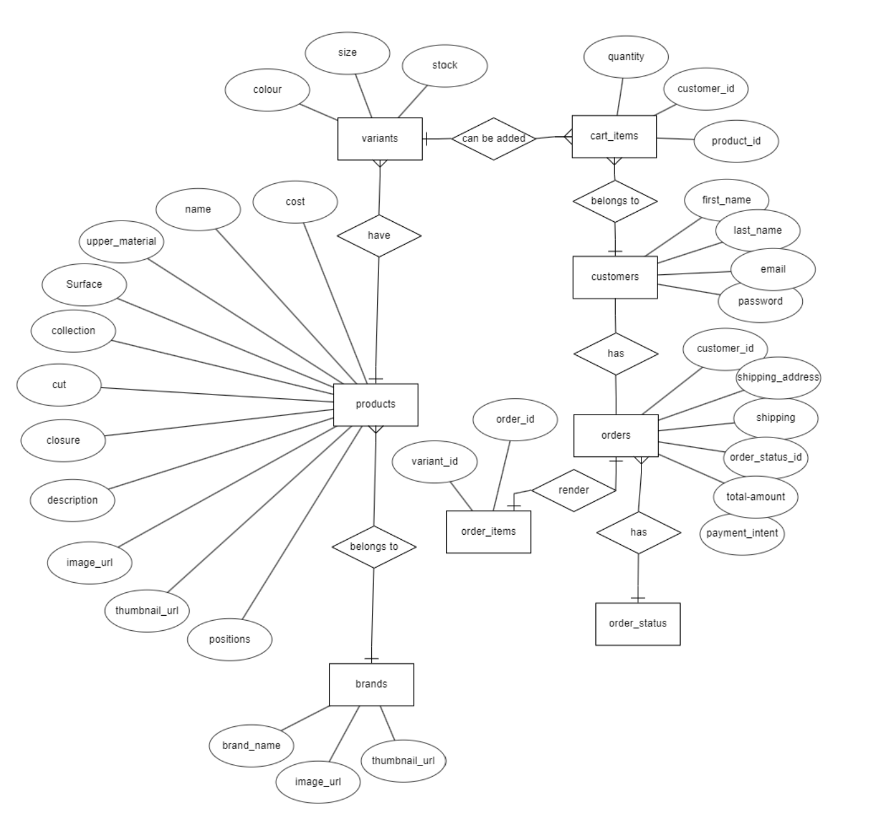
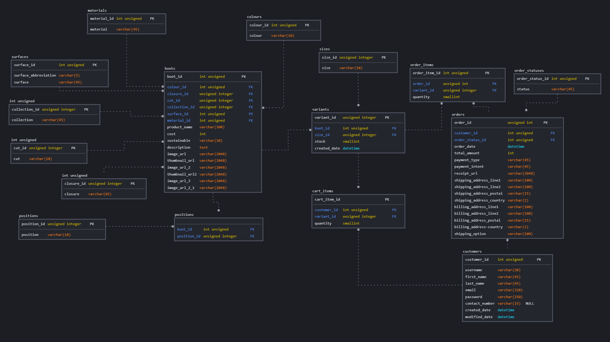

# Kicks Ciry

Access live demo site [here](https://kicks-city.netlify.app/)

<figure>
    
</figure>

Test Accounts:
1. Admin Panel at https://kicks-city.herokuapp.com/users/login
 - email: samuel@kickscity.com
 - password: hello123

2. Customer at https://kicks-city.netlify.app/
 - username: test@email.com
 - password: hello123

## Summary

Those who play football professionally or even as a hobby can be particular about the types of boots that they prefer, as it affects their gameplay performance. Kicks City allows them to be able to filter the shoes by its upper material, studs, their preferred closures and more to help each indiviual find their perfect boot with ease.

## UI/UX

### Strategy

#### Organization's Goals
To create an e-commerce web application selling football boots exclusively. The organisation aims to serve as a go-to platform where customers can browse and purchase football boots based on their personal needs and preferences.

#### User Goals

| User Stories | Accceptance Criteria |
| ------------ | -------------------- |
| As a semi-professional footballer, I would like to get a pair of football boots that is made of leather and studs made for playing on firm ground | Football boots need to be searchable by surface type and upper material. |
| As an avid user of Nike Mercurial football boots, I want to find boots from that brand and collection. | Football boots need to be searchable by brand, collection, surface type and upper material |

### Structure and Skeleton

#### Database

<figure>
    
</figure>
ERD is drawn up to demonstrate the different relationship between enitities for the site before proceeding to model the database (SQL).

<figure>
    
</figure>
Logical Schema is drawn up based on the ERD diagram to show the relationship between tables and also the number of columns with its type defined.q  

#### Wireframes

<!-- to include wireframe -->

#### Color scheme

#### Fonts
*Righteous* is the form family used for the headers in the website as it has letters with sharp edges that fits in with the website design

*sans-serif* is the font family used for the texts in the website as it maintains great readability whether used at small or large sizes.

## Features

### Backend

| Features | Description |
| -------- | ----------- |
| Registration of staff and allowing them to log in and log out | Only staff can access the admin panel via their accounts |
| Management of access via user roles  | Only those with owner roles can access staff management pages to view and register new staff accounts |
| Management of products and variants | Search for products and perform create, update, and delete operations on products and variants | 
| Management of orders | Search for orders and perform update operations on orders |

### Frontend
| Features | Description |
| -------- | ----------- |
| Registration of customer and allowing them to log in and log out | Customers can register for an account using a unique email to login and logout of their accounts |
| Search for products | Customers can search for products using a global keyword search and filter by product specifications |
| Variant selection | The product details page allows user to choose a show size before adding to cart |
| Cart management | Allow logged-in customers to add, update or delete cart items from their carts |
| Cart checkout | Allow logged-in customers to checkout their cart via Stripe |
| View orders | Customers can view all their past orders and their status |

## Technologies Used

### Backend
| Technology | Description |
| ----------- | ----------- |
| [Express](https://expressjs.com/) | Web application framework used |
| [Bookshelf.js](https://bookshelfjs.org/index.html) | JavaScript ORM used for querying SQL databases |
| [knex](https://knexjs.org/) | Query builder for PostgreSQL, MySQL, CockroachDB, SQL Server, SQLite3 and Oracle on node.js |
| [db-migrate](https://db-migrate.readthedocs.io/en/latest/) | Database migration framework used |
| [Axios](https://axios-http.com/docs/intro) | HTTP Client |
| [Caolan Forms](https://github.com/caolan/forms) | Create and validate forms |
| [CORS](https://www.npmjs.com/package/cors) | Middleware to enable Cross-Origin Resource Sharing (CORS) |
| [csurf](https://www.npmjs.com/package/csurf) | CSRF protection middleware |
| [dotenv](https://www.npmjs.com/package/dotenv) | To allow loading of environment variables from .env file |
| [express-session](https://www.npmjs.com/package/express-session) | Session management middleware |
| [connect-flash](https://www.npmjs.com/package/connect-flash) | Middleware to enable Flash messages |
| [express-flash](https://www.npmjs.com/package/express-flash) | Extension of connect-flash to enable definition and rendering of flash message without redirecting request  |
| [JSON Web Token](https://jwt.io/) | Authentication framework with Frontend |
| [Handlebars](https://handlebarsjs.com/) | Used to generate HTML templates for admin panel |
| [handlebars-helpers](https://github.com/helpers/handlebars-helpers) | Handlebars helpers |
| [wax-on](https://www.npmjs.com/package/wax-on) | Add support to Handlebars for template inheritance with `block` and `extends` helpers |
| [Cloudinary](https://cloudinary.com/) | Image hosting service used for upload and storage of images |

### Frontend

| Technology | Description |
| ----------- | ----------- |
| [React](https://reactjs.org/) | Frontend framework |
| [React Router DOM](https://v5.reactrouter.com/web/guides/quick-start) | Handle routing in React web application |
| [Axios](https://axios-http.com/docs/intro) | HTTP Client |
| [React Bootstrap](https://react-bootstrap.github.io/) | BootStrap for React application |
| [Bootstrap](https://getbootstrap.com/docs/5.0/getting-started/introduction/) | Used for styling of web application |
| [React-multi-carousel](https://www.npmjs.com/package/react-multi-carousel) | Used for styling of new arrivals products in web application |
| [Stripe](https://stripe.com/en-sg) | Payment gateway used in web application |


## Testing

<!-- To add testing -->

## Deployment

### Frontend
The website is hosted using [Netlify](https://www.netlify.com/), deployed directly from the main branch of this Github repository.

### Backend
The Express server is hosted using [Heroku](https://www.heroku.com/), deployed directly from the main branch of the Github repository [here]().

The Express server makes use of the following environment variables:

```
SESSION_SECRET=
DB_DRIVER=
DB_USER=
DB_PASSWORD=
DB_DATABASE=
DB_HOST=
CLOUDINARY_NAME=
CLOUDINARY_API_KEY=
CLOUDINARY_API_SECRET=
CLOUDINARY_UPLOAD_PRESET=
TOKEN_SECRET=
REFRESH_TOKEN_SECRET=
STRIPE_PUBLISHABLE_KEY=
STRIPE_SECRET_KEY=
STRIPE_SUCCESS_URL=
STRIPE_CANCEL_URL=
STRIPE_ENDPOINT_SECRET=
```

---

## Credits and Acknowledgement
- Fonts are taken from [Google Fonts](https://fonts.google.com/)
- Product and websites images are taken from [Nike](https://www.nike.com/sg/), [Adidas](https://www.adidas.com.sg/) and [Puma](https://sg.puma.com/)
- Code for Stripe checkout is adapted from [Jerrysuper123](https://github.com/Jerrysuper123/artisanBread)
- Responsive website mockup is created using [CreateMockup.com](https://www.createmockup.com/generate/)